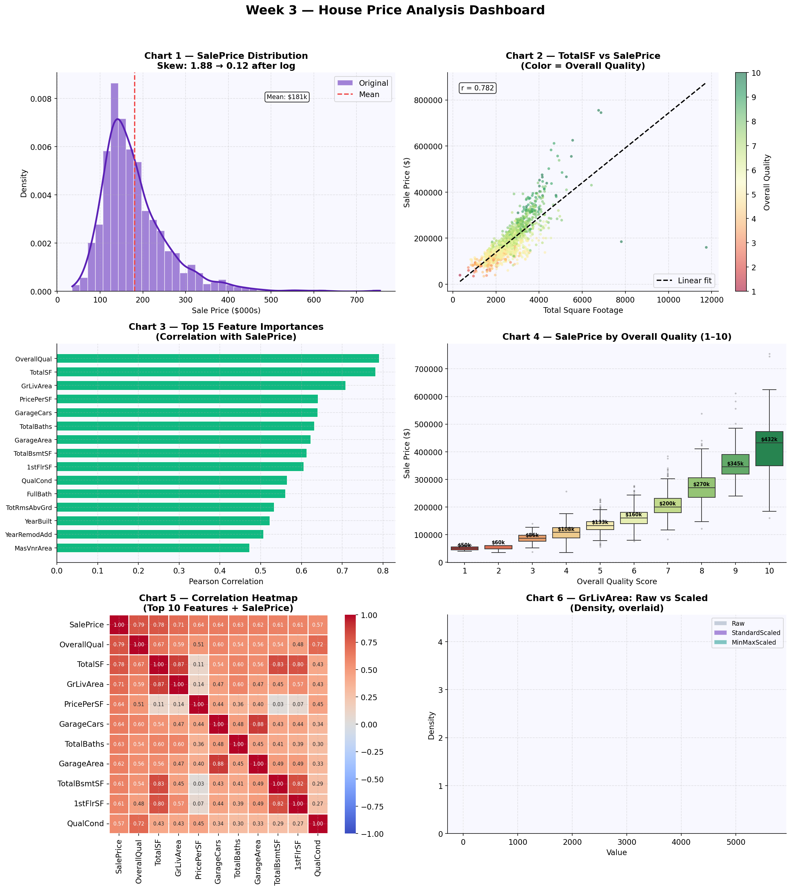

# AIML-Internship-Week3-Haya-Amir-

# AIML Internship — Week 3: Data Visualization & Feature Engineering

**Program:** AI/ML Internship — Week 3 of 8  
**Instructor:** Zain Ul Abideen  
**Topic:** Professional Data Visualization + Feature Engineering

---

## Dataset

**Name:** House Prices — Advanced Regression Techniques  
**Source:** [Kaggle](https://www.kaggle.com/competitions/house-prices-advanced-regression-techniques)  
**Size:** 1,460 rows × 81 columns  
**Target Variable:** `SalePrice` (residential home sale prices in Ames, Iowa)  
**Key Columns:** SalePrice, GrLivArea, OverallQual, YearBuilt, Neighborhood, TotalBsmtSF, GarageCars, FullBath, LotArea, and 72 more features.

---

## 5 Key Findings

1. **SalePrice is heavily right-skewed** — original skewness of **1.88** was reduced to **0.12** after applying `log1p` transformation, making it significantly more suitable for linear ML models.

2. **OverallQual is the single strongest predictor** of SalePrice with a Pearson correlation of **0.79** — homes rated 10/10 sell for an average of **$438,588** vs. just **$50,150** for homes rated 1/10, nearly a 9× difference.

3. **TotalSF (engineered) outperforms individual area features** — combining basement + 1st floor + 2nd floor square footage into one feature yields a correlation of **0.782** with SalePrice, higher than any individual area column.

4. **Neighborhood drives massive price variation** — median prices range from **$315,000** (NridgHt) down to under $100,000 in lower-tier neighborhoods, confirming location as a key pricing driver.

5. **Nearly half of numerical features are highly skewed** — 23 out of 47 numerical features (48.9%) have absolute skewness > 1, making skewness treatment an essential preprocessing step before any linear model.

---

## Top 3 Features Engineered

| # | Feature | Formula | Correlation with SalePrice | Why It Matters |
|---|---------|---------|---------------------------|----------------|
| 1 | **TotalSF** | `TotalBsmtSF + 1stFlrSF + 2ndFlrSF` | **0.782** | Combines all liveable area into one signal — more predictive than any single area column. Buyers pay for total usable space. |
| 2 | **TotalBaths** | `FullBath + 0.5×HalfBath + BsmtFullBath + 0.5×BsmtHalfBath` | **0.632** | Weighted bathroom count captures the actual utility of full vs. half baths — a full bath adds more value than a half bath. |
| 3 | **HouseAge** | `YrSold - YearBuilt` | **-0.523** | Age at time of sale captures depreciation directly — newer homes command a clear premium, and the negative correlation confirms older homes sell for less. |

---

## Tools Used

| Library | Version | Purpose |
|---------|---------|---------|
| Python | 3.x | Core language |
| pandas | 2.0+ | Data loading, manipulation, feature creation, encoding |
| NumPy | 1.24+ | Numerical transformations (log1p, sqrt, corrcoef) |
| Matplotlib | 3.7+ | All chart types, multi-panel dashboard figures |
| Seaborn | 0.12+ | Statistical visualization (heatmaps, boxplots, pairplots, FacetGrid) |
| scikit-learn | 1.3+ | StandardScaler, MinMaxScaler, RobustScaler, LabelEncoder, VarianceThreshold |
| SciPy | 1.11+ | Box-Cox transformation, skewness statistics |
| Google Colab | — | Execution environment |

---

## Dashboard Preview




## Feature Engineering Pipeline Summary

```
Raw Data (1460 × 81)
      ↓
Feature Creation       →  8 new features engineered (TotalSF, TotalBaths, HouseAge, etc.)
      ↓
Categorical Encoding   →  Label encoding (quality cols), OHE (nominal ≤10 cats), Frequency (Neighborhood)
      ↓
Skewness Treatment     →  log1p applied to 23 highly skewed features; SalePrice_transformed saved
      ↓
Feature Scaling        →  StandardScaler, MinMaxScaler, RobustScaler compared
      ↓
Feature Selection      →  Top 30 by correlation → Variance threshold → Multicollinearity removal
      ↓
ML-Ready Dataset
```

---

## Key Results at a Glance

- **SalePrice skewness:** 1.88 → 0.12 (log1p transformation)
- **Engineered features in top 20 by correlation:** TotalSF (rank 2), TotalBaths (rank 7), QualCond (rank 11), HouseAge (rank 14)
- **Highly skewed features treated:** 23 / 47 numerical columns
- **Best single predictor:** OverallQual (r = 0.79)
- **Best engineered predictor:** TotalSF (r = 0.782)

---

*Week 3 of 8 — AI/ML Internship Program | Instructor: Zain Ul Abideen*
